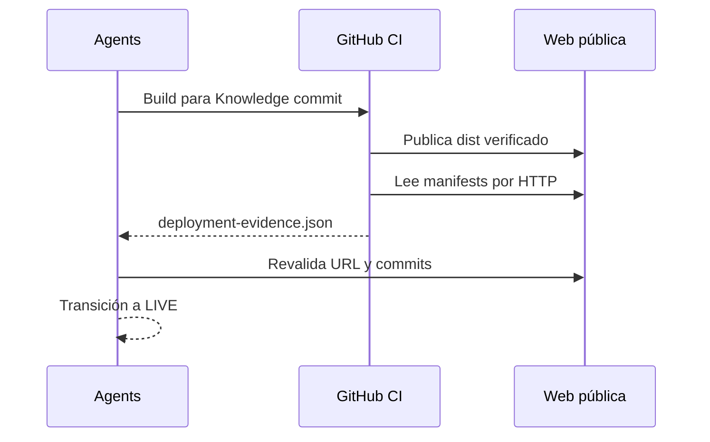

# Integración con Agents

Agents inicia u observa CI para un Knowledge commit exacto. La evidencia válida exige `status: VERIFIED`, run/attempt, tres commits, digest del manifiesto, base URL, URLs publicadas, hora de plataforma y verificación HTTP. Agents debe descargar también los dos manifests públicos y repetir la comparación.

La URL de un Article se obtiene de `build-info.json.publishedArticles`. Si no aparece, la respuesta es `NOT_PUBLISHABLE`; no se construye una URL sintética. Un resultado CI `SUCCESS` sin evidencia HTTP no permite `LIVE`.

Agents v0.1.0 puede mapear `publicUrl` y `webCommit` de inmediato. Para verificar integralmente este contrato se propone ampliar `PublicationEvidencePort.verify` con `knowledgeCommit`, `specCommit`, `buildManifestDigest`, `workflowRunId` y estado HTTP, manteniendo el resultado actual como vista compatible.
