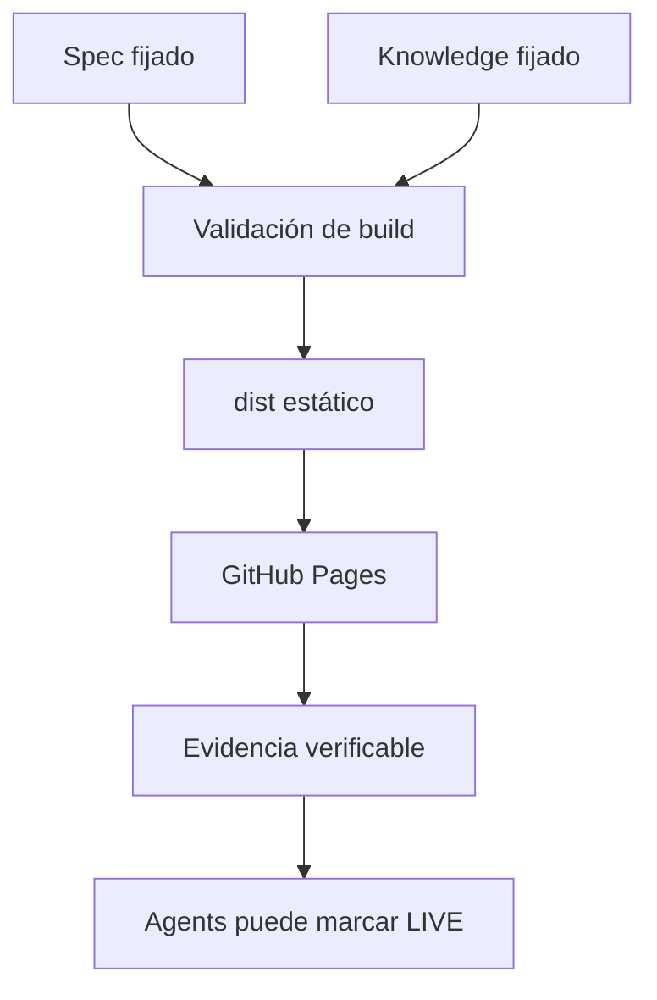

# Arquitectura

Web es una proyección desechable de Knowledge, nunca una fuente editorial.

El proceso verifica el manifiesto derivado, carga las entidades por ID, resuelve referencias, aplica elegibilidad editorial y derechos, deriva un modelo de vista efímero y escribe HTML/CSS/JS/JSON estático. En producción no existen llamadas a Knowledge o Agents, backend, base de datos ni framework de navegador.

Los límites del código son: `src/content` para seguridad e ingesta; `src/templates` para HTML semántico; `src/build` para orquestación y hashes; `src/browser` para mejoras progresivas; `src/styles` para tokens y layout. `dist/` se elimina y reconstruye en cada build.

El sitio funciona sin JavaScript. El único módulo del navegador habilita búsqueda local con `fetch` y creación segura de nodos DOM; no usa `innerHTML`.
